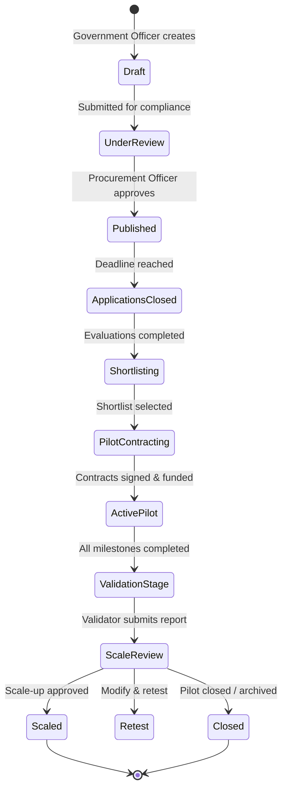

# GovInnovate System Architecture Specification

## 1. System Overview & Executive Summary

GovInnovate is an enterprise-grade GovTech operating system designed to govern the full lifecycle of public innovation procurement: from initial government problem definition to open challenge publication, competitive startup discovery, eligibility screening, blind multi-expert evaluation, shortlisting, pilot contract setup, milestone execution, real-time KPI and telemetry tracking, tamper-evident evidence collection, third-party independent validation, milestone-linked payment release, and structured procurement scale-up.

Unlike basic startup discovery platforms or generic project trackers, GovInnovate enforces:
1. **Traceability & Auditability**: Every state transition, document submission, score entry, and financial approval is immutably recorded.
2. **Fairness & Integrity**: Blind scoring protocols, strict conflict-of-interest declarations, and automated role segregation prevent procurement bias.
3. **Evidence-Based Governance**: Milestone payments are tied strictly to validated KPI measurements and verifiable evidence.
4. **Spatial & Ecosystem Visibility**: Purpose-built, lightweight 3D visualizations map innovation pipelines, urban pilot locations, and public infrastructure data without compromising enterprise usability.

---

## 2. High-Level Architecture Diagram

```mermaid
flowchart TB
    subgraph ClientLayer ["Client Presentation Layer (Next.js / React / TypeScript)"]
        Landing3D["Landing Page 3D Architectural City (Three.js / R3F)"]
        GovDash["Government Dashboard & Pipeline 3D Map"]
        StartupPortal["Startup Discovery & Application Workspace"]
        ExpertPortal["Blind Evaluation Workbench"]
        ValidatorPortal["Independent Validation Studio"]
        AdminConsole["System Administration & Audit Console"]
    end

    subgraph APILayer ["API & Application Gateway Layer (Node.js / Express / Next.js API Routes)"]
        Gateway["Reverse Proxy & Rate Limiting (CORS, Helmet, RateLimiter)"]
        AuthMiddleware["Auth & RBAC Middleware (JWT / Session Guard)"]
        ValidationMiddleware["Input Validation Engine (Zod Runtime Schemas)"]
        AuditInterceptor["Audit Log Interceptor (Event Capture)"]
    end

    subgraph ServiceLayer ["Domain Business Logic Layer"]
        ChallengeService["Challenge Lifecycle Service"]
        ApplicationService["Application & Eligibility Service"]
        EvaluationService["Blind Scoring & Rubric Engine"]
        PilotService["Pilot & Milestone Execution Engine"]
        KPIService["KPI & Telemetry Time-Series Service"]
        EvidenceService["Evidence Verification Engine"]
        PaymentService["Milestone Payment Dispatcher"]
        ValidationService["Third-Party Validation Engine"]
        ScaleUpService["Procurement & Scale-Up Decision Service"]
        AIAssistantService["AI Challenge & KPI Synthesis (LLM Orchestrator)"]
        SpatialService["3D Scene & GeoData Aggregator"]
        NotificationService["Notification Dispatcher (In-app / Email)"]
    end

    subgraph PersistenceLayer ["Persistence & Storage Infrastructure"]
        PostgresDB[("PostgreSQL 16 Enterprise Relational Database")]
        AuditStore[("Immutable Audit Trail (Hash-chained Log)")]
        ObjectStorage[("S3-Compatible Object Storage (Documents, Sensor Data, Evidence)")]
        TimeSeriesStore[("Postgres Timescale/Partitioned KPI Measurements")]
    end

    ClientLayer --> APILayer
    APILayer --> ServiceLayer
    ServiceLayer --> PersistenceLayer
```



---

## 3. Frontend Architecture

### 3.1 Framework & Core Stack
- **Framework**: Next.js 14+ (App Router) / React 18+ with strict TypeScript (`strict: true`).
- **Styling**: Tailwind CSS with custom theme tokens mirroring the GovInnovate Design System:
  - Background: `#F7F8FA`
  - Dark Surface: `#111827`
  - Primary Slate/Navy: `#163A5F`
  - Accent Blue: `#2563EB`
  - Success Green: `#15803D`
  - Warning Amber: `#B45309`
  - Danger Red: `#B91C1C`
  - Primary Text: `#172033`
  - Muted Text: `#667085`
  - Border: `#D9DEE7`
- **Component Primitives**: Radix UI headless primitives (Dialog, DropdownMenu, Tabs, Accordion, Tooltip, Popover, Select, Slider) wrapped in accessible, reusable UI components.
- **Iconography**: Lucide React (clean, restrained, 20px / 16px standard sizing).
- **Typography**: Inter via `@next/font/google`, with strict modular scale (`Display`, `H1`, `H2`, `H3`, `Body`, `Caption`, `Metadata`).

### 3.2 UI Structure & UX Pattern Enforcement
Following Section 48 & 49 of the product vision:
- **No Card Overload**: Dense data is laid out using tables, split views, drawers, horizontal step wizards, timeline streams, and data panels.
- **Responsive Layout**: Desktop-first design optimized for 1440px+ and 1080p government displays, with responsive degradation down to tablet (768px) and mobile (375px). Data tables support horizontal scrollbars and sticky primary columns.
- **Accessibility (a11y)**: WCAG 2.1 AA compliance:
  - Minimum 4.5:1 text-to-background contrast ratio.
  - Visible focus rings (`focus-visible:ring-2 focus-visible:ring-blue-600 focus-visible:ring-offset-2`).
  - Semantic HTML (`<main>`, `<nav>`, `<header>`, `<section>`, `<table>`, `<article>`).
  - Screen reader announcements (`aria-live="polite"`) for state changes.
  - No color-only information delivery (icons and text badges accompany all status colors).

### 3.3 State Management Architecture
- **Server State**: TanStack Query (React Query v5) manages caching, background invalidation, optimistic updates, and loading/error states for all REST endpoints.
- **Client UI State**: Zustand stores for lightweight, persistent local state:
  - `useAuthStore`: Active session, user profile, active role, department scope.
  - `useFilterStore`: Multi-faceted search filters for Challenges, Pilots, and Proven Solutions.
  - `useDraftStore`: Multi-step form drafts (Challenge wizard, Application wizard) backed by `sessionStorage`/`localStorage`.
  - `use3DSceneStore`: Camera position, selected city nodes, LOD settings, WebGL capability flags.
- **Form State & Validation**: React Hook Form coupled with Zod resolvers for client-side validation mirrors backend schemas.

---

## 4. Backend Architecture

### 4.1 Modular Monolith Clean Architecture
The backend follows Domain-Driven Design (DDD) principles implemented as a clean modular monolith:

```
src/
├── api/                  # HTTP Routers & Controller Endpoints
├── domain/               # Domain Models, State Machines & Business Logic
│   ├── challenge/        # Creation, approval, publishing, closing
│   ├── application/      # Submission, draft, eligibility screening
│   ├── evaluation/       # Rubrics, assignment, blind scoring, consensus
│   ├── pilot/            # Agreement, execution, tracking, risk, issues
│   ├── kpi/              # Baseline, targets, historical measurements
│   ├── evidence/         # Uploads, checksums, validator verification
│   ├── payment/          # Milestone linkage, escrow/approval state
│   ├── validation/       # Third-party validator reports, outcomes
│   ├── scaleup/          # Promotion to proven solutions, scale decisions
│   └── audit/            # Tamper-evident logging
├── infrastructure/       # Repositories, Database Client, Object Storage, Email
├── services/             # Cross-cutting Application Services (AI, Notification)
└── shared/               # Standard DTOs, Zod Schemas, Error Envelopes
```

### 4.2 Layered Responsibilities
1. **Controller Layer**: Decodes HTTP requests, runs Zod request validation, verifies authentication and RBAC permissions, and delegates to the appropriate domain service.
2. **Domain Service Layer**: Enforces business rules, executes state transitions (e.g. ensuring an application cannot be shortlisted unless all assigned expert evaluations are completed), coordinates DB transactions, and publishes domain events.
3. **Repository Layer**: Encapsulates PostgreSQL SQL / Prisma queries, enforcing tenant scoping and database-level locking (`SELECT ... FOR UPDATE` for payment approvals and evaluation submissions).
4. **Event & Audit Bus**: Synchronously or asynchronously captures state transitions and writes immutable audit logs.

---

## 5. Database Architecture

- **Engine**: PostgreSQL 16+.
- **Transactional Integrity**: ACID-compliant transactions ensure that complex multi-entity transitions (e.g., approving a milestone automatically moves payment to `APPROVED`, records a KPI snapshot, updates overall pilot progress percentage, and writes an audit log) execute atomically.
- **Row Locking**: Pipelined state transitions use `SELECT ... FOR UPDATE` to prevent race conditions during concurrent evaluation submissions or payment status updates.
- **Dynamic Form Handling**: Core entities use structured relational columns for all queried fields (status, dates, scores, budgets, roles), while `jsonb` is utilized strictly for dynamic evaluation criteria rubrics, custom eligibility questions, and flexible sensor/telemetry payloads.
- **Indexing Strategy**:
  - B-tree indexes on foreign keys (`challenge_id`, `pilot_id`, `milestone_id`, `user_id`).
  - Compound indexes on status and query filters (`(status, department_id, deadline)`).
  - PostgreSQL Full-Text Search (`tsvector` / GIN index) on Challenge problem statements, solution descriptions, and Proven Solutions for instant search.

---

## 6. Authentication Architecture

- **Mechanism**: JWT (JSON Web Tokens) with dual-token strategy:
  - **Access Token**: Short-lived (15 minutes), signed with `RS256` or secure `HS256`, containing `sub`, `email`, `role`, `department_id`, and `org_id`.
  - **Refresh Token**: Long-lived (7 days), stored in an `httpOnly`, `Secure`, `SameSite=Strict` cookie, hashed in the database with revocation support.
- **Session & Identity Provider**: Ready for Government Single Sign-On (SAML 2.0 / OAuth2 / OpenID Connect) integration with local email/password credentials for evaluation and development testing.
- **Password Security**: Passwords hashed with Argon2id (or bcrypt with cost factor 12).
- **Department & Organization Context**: Authenticated tokens carry tenant IDs (`department_id` for Government Officers, `company_id` for Startups). Requests automatically scope data queries to the user's authorized organizational boundary.

---

## 7. Role-Based Access Control (RBAC) Architecture

The platform supports 6 distinct roles with strict permission boundaries:

1. **Government Officer**:
   - Creates and edits department challenges.
   - Conducts eligibility screening.
   - Assigns independent experts.
   - Reviews anonymized evaluation summaries.
   - Shortlists applications and initiates pilot contracts.
   - Monitors pilot milestones, KPIs, and risks.
   - Approves milestone completion and requests payment release.
   - Makes pilot scale-up / procurement decisions.
2. **Procurement Officer**:
   - Approves challenge publication for compliance with public procurement rules.
   - Validates RFP/challenge legal compliance, NDA/IP agreements.
   - Authorizes and releases milestone disbursements.
   - Oversees final scale-up procurement contracts.
3. **Startup (Applicant / Pilot Partner)**:
   - Manages company profile, capabilities, and past projects.
   - Discovers challenges, submits questions, applies to challenges.
   - Manages pilot milestones: uploads deliverables, logs KPI measurements, submits evidence.
   - Tracks milestone approval and payment disbursement status.
4. **Expert / Evaluator**:
   - Accesses assigned proposals.
   - Must sign a formal **Conflict of Interest (COI)** declaration before viewing any proposal details.
   - **Blind Evaluation**: Evaluates proposals against weighted rubrics without seeing competitor scores or applicant identifying markers (when blind mode is enabled).
   - Submits scores and technical commentary. Once submitted, score is locked.
5. **Independent Validator**:
   - Assesses pilots post-milestone or at pilot completion.
   - Reviews baseline vs. target KPI measurements, sensor feeds, and verification evidence.
   - Conducts on-site or methodology verification audits.
   - Issues formal Validation Report with status: `VALIDATED`, `PARTIALLY_VALIDATED`, or `NOT_VALIDATED`, citing methodology limitations.
6. **Platform Administrator**:
   - Manages platform users, departments, and category taxonomies.
   - Configures evaluation rubric templates and compliance checklists.
   - Views system health, analytics, and tamper-evident audit logs.
   - Cannot tamper with or delete submitted scores or audit logs.

---

## 8. File Storage Architecture

- **Storage Provider**: S3-compatible Object Storage (MinIO for local dev, AWS S3 / Cloud Storage for production).
- **Direct-to-Storage Upload Flow**:
  1. Client requests a pre-signed PUT URL from `/api/uploads/presigned-url` with file metadata (filename, MIME type, size, checksum).
  2. Server validates MIME type against whitelist (`application/pdf`, `image/png`, `image/jpeg`, `text/csv`, `application/json`), verifies size limits (max 50MB for evidence, 10MB for documents), checks user authorization for the target entity, and issues a short-lived presigned URL.
  3. Client uploads directly to the object store.
  4. Client confirms upload to `/api/uploads/confirm`, which triggers server-side checksum calculation (`SHA-256`), records file metadata in the `documents` or `evidence` table, and queues an anti-malware/virus scan job.
- **Evidence Integrity**: Every evidence file record stores an immutable `sha256_hash` to ensure data has not been altered post-upload.

---

## 9. API Architecture & Standards

- **Protocol**: RESTful JSON over HTTPS.
- **Standardized Response Envelope**:
  ```json
  {
    "success": true,
    "data": { ... },
    "meta": {
      "page": 1,
      "limit": 20,
      "total": 142
    },
    "timestamp": "2026-09-27T00:50:00.000Z"
  }
  ```
- **Standardized Error Envelope**:
  ```json
  {
    "success": false,
    "error": {
      "code": "INVALID_STATE_TRANSITION",
      "message": "Cannot approve milestone before all required KPI evidence is verified.",
      "details": [
        { "field": "evidence_id", "issue": "Pending validation" }
      ]
    },
    "timestamp": "2026-09-27T00:50:00.000Z"
  }
  ```
- **Idempotency**: Critical state mutations (e.g. payment processing, final evaluation submission, challenge publishing) support an `Idempotency-Key` HTTP header to prevent duplicate execution on network retry.

---

## 10. State Management & Lifecycle State Machines

Every core entity implements an explicit, deterministic finite state machine (FSM). Invalid transitions are rejected at the service layer with HTTP 422 Unprocessable Entity.



---

## 11. Validation Architecture

Validation is applied at three layers:
1. **Client Layer**: Zod schema parsed via React Hook Form provides immediate inline feedback (e.g., budget cannot be negative, date must be in the future, required fields).
2. **API Layer**: Express / Next.js middleware executes identical Zod schemas against `req.body`, `req.query`, and `req.params`. Invalid payloads fail fast with structured 400 Bad Request responses.
3. **Database Layer**: Strict PostgreSQL constraints (`CHECK (score >= 0 AND score <= 100)`, `CHECK (budget > 0)`, `FOREIGN KEY ... ON DELETE RESTRICT`).

---

## 12. Notification Architecture

- **Event-Driven Dispatcher**: Core business events trigger notifications:
  - `APPLICATION_SUBMITTED` -> Government Officer notified.
  - `EVALUATION_ASSIGNED` -> Expert notified.
  - `MILESTONE_SUBMITTED` -> Government Officer & Validator notified.
  - `EVIDENCE_UPLOADED` -> Validator notified.
  - `PAYMENT_APPROVED` -> Startup & Procurement Officer notified.
  - `RISK_THRESHOLD_EXCEEDED` -> Pilot Owner & Dept Head alerted.
- **Channels**:
  1. **In-App Notification Center**: Unread count badge, real-time polling / WebSocket stream, actionable deep link (`/pilots/42/milestones/3`).
  2. **Transactional Email**: Async worker sends transactional notifications (using Nodemailer / SMTP / SendGrid adapter) for critical deadlines and contract signatures.

---

## 13. Audit Logging Architecture

Following Section 37 of the product vision, every critical decision and state change is immutably logged:

- **Audit Log Schema**:
  - `id`: UUIDv7 (time-ordered).
  - `user_id`: ID of acting user (or `SYSTEM`).
  - `user_role`: Active role at time of action.
  - `action`: Canonical action name (e.g. `CHALLENGE_PUBLISHED`, `EVALUATION_SUBMITTED`, `PAYMENT_RELEASED`, `VALIDATION_SUBMITTED`).
  - `entity_type`: Target table (e.g. `challenges`, `applications`, `milestones`, `payments`).
  - `entity_id`: UUID of target entity.
  - `previous_state`: JSONB snapshot of entity prior to modification.
  - `new_state`: JSONB snapshot of entity after modification.
  - `ip_address` & `user_agent`: Client network metadata.
  - `tamper_hash`: Cryptographic SHA-256 hash chaining `tamper_hash = SHA256(prev_log.tamper_hash + current_log_data)`.
- **Immutability Guarantee**: The database user for general operations has `INSERT` and `SELECT` privileges only on `audit_logs`. `UPDATE` and `DELETE` grants are strictly denied.

---

## 14. AI Layer Architecture

Per Section 18 of the product vision:
- **Purpose**: Assist human officers with challenge drafting, problem structuring, missing data detection, KPI recommendation, and application summarization.
- **Strict Human-in-the-Loop Guardrail**:
  - AI does **NOT** make procurement, scoring, or payment decisions.
  - Every AI output is accompanied by a mandatory visual disclaimer:
    `"AI-generated suggestion — verify before publishing."`
  - Output is formatted as editable draft text in form inputs; the user must explicitly review and save.
- **Technical Implementation**:
  - Modular AI Orchestrator service calling Gemini 1.5 Pro / Flash via structured JSON mode (`response_schema`).
  - Standardized prompt templates for:
    1. `ProblemRefinement`: Turns vague municipal complaints into structured challenges with quantifiable objectives.
    2. `KPIGeneration`: Suggests baseline, target, unit, and verification methodologies based on problem domain (e.g. air quality, traffic, sanitation).
    3. `ApplicationCompletenessCheck`: Detects gaps in startup submissions before final submission.

---

## 15. 3D Visualization Architecture

Per Section 4, 42, 43, 44 & 45 of the product vision:

### 15.1 Architectural Principles
- **Selective 3D**: Used only where spatial, topological, or architectural perspective enhances comprehension (Landing Page City Scene, Dashboard Innovation Ecosystem, Pilot Geographic Infrastructure Map).
- **Strict 2D Boundary**: Forms, data tables, legal agreements, rubrics, and dense analytics remain clean, accessible 2D components.
- **Performance Budget**:
  - Max draw calls < 80.
  - Max polygon count < 85,000 vertices.
  - Textures procedural or compressed (< 500KB total).
  - Target 60 FPS on integrated GPUs; automatic frame-rate throttling (down to 30 FPS or idle pause when canvas is out of viewport via `IntersectionObserver`).
- **Graceful 2D Fallback**: Automatic WebGL feature detection (`isWebGLAvailable()`). If WebGL is disabled or GPU memory is insufficient, seamlessly renders an SVG/Canvas architectural schematic with identical interactive tooltip data.

### 15.2 Technology Stack
- **Three.js** + **@react-three/fiber (R3F)**: Declarative scene graph inside React.
- **@react-three/drei**: Camera controls (`OrbitControls` with strict damping and polar/azimuth angle limits), HTML overlays (`Html`), and procedural geometry helpers.
- **Shaders & Lighting**: Custom subtle standard materials (`MeshStandardMaterial`), directional daylighting (`#FFFFFF` key light + `#94A3B8` fill light), ambient occlusion, and subtle glowing pulse shaders for active pilot nodes.

### 15.3 Scene Implementations
1. **Landing Page Hero (Architectural City)**:
   - Stylized low-poly city grid representing municipal infrastructure (buildings, roads, transit, IoT sensor stations).
   - Dynamic glowing spline lines tracing data movement: `Challenge (City Hall) -> Startup -> Pilot Site -> Evidence Node -> Validated Scale`.
   - Hovering over a glowing node reveals pilot metadata (e.g. "Air Quality Monitoring - Lucknow").
2. **Dashboard Innovation Ecosystem Visualizer**:
   - Spatial node-link diagram mapping the 5 stages: `Challenges -> Applications -> Pilots -> Validation -> Scale`.
   - Node scale represents volume; glowing particles indicate pilots currently in flight.
3. **Pilot Geographic Infrastructure View**:
   - 3D spatial terrain / district layout for pilots with physical deployment sites.
   - Interactive pins for sensor nodes, project locations, and real-time risk indicators.

---

## 16. Analytics Engine Architecture

- **Aggregated Performance Metrics**:
  - Procurement cycle velocity (days from Problem Statement to Pilot Deployment).
  - Challenge conversion funnel (Views -> Applications -> Shortlisted -> Validated).
  - Portfolio KPI Achievement Rate (% of pilots hitting target metrics).
  - Budget Utilization & Payment Disbursement Velocity.
  - Cross-department innovation index and risk distribution.
- **Implementation**:
  - SQL aggregation views (`materialized views` refreshed periodically for heavy historical analytics).
  - Recharts / Chart.js for accessible 2D dashboard visualizations.
  - Zero vanity charts: every visual metric corresponds to an operational decision metric.

---

## 17. Security Architecture

- **Protection Against Top Vulnerabilities**:
  - **Injection**: Parameterized SQL queries via ORM / SQL query builders; no string concatenation.
  - **XSS**: Automatic React escaping + DOMPurify on any sanitized rich-text fields.
  - **CSRF**: `SameSite=Strict` cookies + custom `X-Requested-With` / Bearer token headers.
  - **CORS**: Strict whitelist limited to authorized deployment origins.
  - **Security Headers**: `Helmet` configured with strict Content Security Policy (`script-src`, `style-src`, `connect-src`), `X-Frame-Options: DENY`, `X-Content-Type-Options: nosniff`.
  - **Rate Limiting**: IP and user-based sliding window rate limits on auth routes (`10 requests / min`) and general API routes (`120 requests / min`).
- **Confidentiality & Blind Scoring Safeguards**:
  - Expert evaluation endpoints reject any request to read co-evaluator scores prior to submission.
  - Application submissions can be scrubbed of startup corporate identity markers when a challenge specifies `blind_evaluation = true`.
  - Private legal documents (IP agreements, NDAs, proprietary tech blueprints) are accessed strictly via expiring presigned URLs (valid for 5 minutes) issued only after verifying the user's role and assignment.
