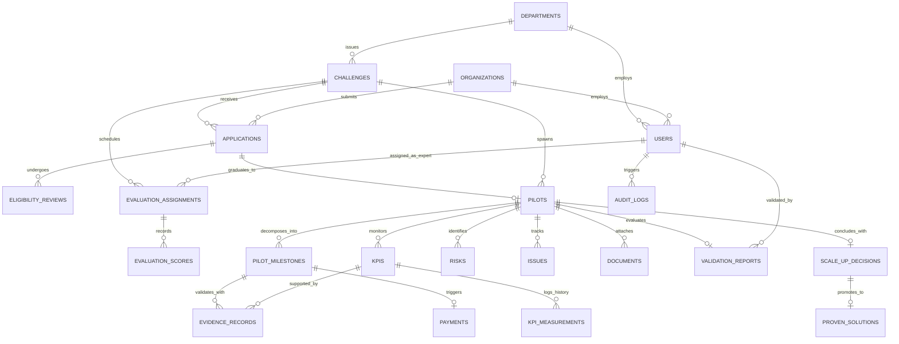

# GovInnovate Relational Database Schema Specification

## 1. Schema Overview

GovInnovate utilizes PostgreSQL 16+ as its primary relational datastore. The schema enforces strict referential integrity, domain constraints (`CHECK`), transaction isolation, and auditability across all 14 lifecycle stages:

```
Government Problem -> Challenge -> Application -> Eligibility Screening -> Expert Evaluation -> 
Shortlisting -> Pilot Contracting -> Milestones -> KPI Measurements -> Evidence Verification -> 
Independent Validation -> Milestone Payment -> Scale-Up Procurement -> Proven Solutions Library
```

---

## 2. Mermaid Entity-Relationship Diagram (ERD)



---

## 3. Enumerations (Custom Postgres Types)

```sql
-- Role System
CREATE TYPE user_role AS ENUM (
    'GOVERNMENT_OFFICER',
    'PROCUREMENT_OFFICER',
    'STARTUP',
    'EXPERT_EVALUATOR',
    'INDEPENDENT_VALIDATOR',
    'PLATFORM_ADMIN'
);

-- Challenge Status
CREATE TYPE challenge_status AS ENUM (
    'DRAFT',
    'UNDER_REVIEW',
    'PUBLISHED',
    'APPLICATIONS_CLOSED',
    'UNDER_EVALUATION',
    'SHORTLISTED',
    'PILOT_ACTIVE',
    'COMPLETED',
    'ARCHIVED'
);

-- Application Status
CREATE TYPE application_status AS ENUM (
    'DRAFT',
    'SUBMITTED',
    'UNDER_ELIGIBILITY',
    'ELIGIBLE',
    'CONDITIONALLY_ELIGIBLE',
    'INELIGIBLE',
    'UNDER_EVALUATION',
    'SHORTLISTED',
    'NOT_SELECTED',
    'PILOT_AWARDED',
    'WITHDRAWN'
);

-- Eligibility Decision
CREATE TYPE eligibility_decision AS ENUM (
    'ELIGIBLE',
    'CONDITIONALLY_ELIGIBLE',
    'INELIGIBLE',
    'CLARIFICATION_REQUIRED'
);

-- Pilot Status
CREATE TYPE pilot_status AS ENUM (
    'CONTRACTING',
    'ACTIVE',
    'PAUSED',
    'UNDER_VALIDATION',
    'COMPLETED',
    'TERMINATED',
    'SCALE_PENDING',
    'SCALED',
    'CLOSED'
);

-- Milestone Status
CREATE TYPE milestone_status AS ENUM (
    'NOT_STARTED',
    'IN_PROGRESS',
    'SUBMITTED',
    'UNDER_REVIEW',
    'APPROVED',
    'REJECTED',
    'OVERDUE'
);

-- Evidence Verification Status
CREATE TYPE verification_status AS ENUM (
    'PENDING',
    'VERIFIED',
    'REJECTED',
    'CLARIFICATION_REQUESTED'
);

-- Payment Status
CREATE TYPE payment_status AS ENUM (
    'NOT_DUE',
    'PENDING_APPROVAL',
    'APPROVED',
    'PROCESSING',
    'PAID',
    'FAILED',
    'CANCELLED'
);

-- Validation Outcome
CREATE TYPE validation_outcome AS ENUM (
    'VALIDATED',
    'PARTIALLY_VALIDATED',
    'NOT_VALIDATED'
);

-- Scale-up Outcome
CREATE TYPE scale_up_outcome AS ENUM (
    'SCALE',
    'EXTEND_PILOT',
    'MODIFY_AND_RETEST',
    'CLOSE'
);

-- Risk Categories & Status
CREATE TYPE risk_category AS ENUM (
    'TECHNICAL',
    'FINANCIAL',
    'OPERATIONAL',
    'LEGAL',
    'CYBERSECURITY',
    'DATA',
    'PROCUREMENT',
    'TIMELINE'
);

CREATE TYPE risk_status AS ENUM (
    'IDENTIFIED',
    'MITIGATING',
    'CONTROLLED',
    'CLOSED'
);

CREATE TYPE issue_severity AS ENUM (
    'LOW',
    'MEDIUM',
    'HIGH',
    'CRITICAL'
);

CREATE TYPE issue_status AS ENUM (
    'OPEN',
    'IN_PROGRESS',
    'BLOCKED',
    'RESOLVED',
    'CLOSED'
);

-- Document Legal Categories
CREATE TYPE document_category AS ENUM (
    'PILOT_AGREEMENT',
    'NDA',
    'DATA_AGREEMENT',
    'IP_AGREEMENT',
    'SECURITY_CHECKLIST',
    'EVALUATION_REPORT',
    'VALIDATION_REPORT',
    'PROCUREMENT_DOCUMENT',
    'OTHER'
);
```

---

## 4. Table Definitions & DDL

### 4.1 Organizations & Departments

```sql
CREATE TABLE departments (
    id UUID PRIMARY KEY DEFAULT gen_random_uuid(),
    code VARCHAR(32) NOT NULL UNIQUE,
    name VARCHAR(255) NOT NULL,
    ministry VARCHAR(255) NOT NULL,
    state VARCHAR(100) NOT NULL,
    district VARCHAR(100),
    contact_email VARCHAR(255) NOT NULL,
    created_at TIMESTAMPTZ NOT NULL DEFAULT NOW(),
    updated_at TIMESTAMPTZ NOT NULL DEFAULT NOW()
);

CREATE TABLE organizations (
    id UUID PRIMARY KEY DEFAULT gen_random_uuid(),
    legal_name VARCHAR(255) NOT NULL,
    trade_name VARCHAR(255),
    registration_number VARCHAR(100) NOT NULL UNIQUE,
    incorporation_date DATE NOT NULL,
    dpiit_recognition_number VARCHAR(100), -- For startup certification
    website_url VARCHAR(500),
    industry VARCHAR(100) NOT NULL,
    technology_stack TEXT[],
    team_size INT DEFAULT 1,
    profile_completeness INT DEFAULT 0 CHECK (profile_completeness BETWEEN 0 AND 100),
    created_at TIMESTAMPTZ NOT NULL DEFAULT NOW(),
    updated_at TIMESTAMPTZ NOT NULL DEFAULT NOW()
);
```

### 4.2 Users & Authentication

```sql
CREATE TABLE users (
    id UUID PRIMARY KEY DEFAULT gen_random_uuid(),
    email VARCHAR(255) NOT NULL UNIQUE,
    password_hash VARCHAR(255) NOT NULL,
    first_name VARCHAR(100) NOT NULL,
    last_name VARCHAR(100) NOT NULL,
    phone VARCHAR(32),
    role user_role NOT NULL,
    department_id UUID REFERENCES departments(id) ON DELETE SET NULL,
    organization_id UUID REFERENCES organizations(id) ON DELETE SET NULL,
    designation VARCHAR(150),
    is_active BOOLEAN NOT NULL DEFAULT TRUE,
    last_login_at TIMESTAMPTZ,
    created_at TIMESTAMPTZ NOT NULL DEFAULT NOW(),
    updated_at TIMESTAMPTZ NOT NULL DEFAULT NOW()
);

CREATE TABLE user_sessions (
    id UUID PRIMARY KEY DEFAULT gen_random_uuid(),
    user_id UUID NOT NULL REFERENCES users(id) ON DELETE CASCADE,
    refresh_token_hash VARCHAR(255) NOT NULL UNIQUE,
    ip_address INET,
    user_agent TEXT,
    expires_at TIMESTAMPTZ NOT NULL,
    revoked_at TIMESTAMPTZ,
    created_at TIMESTAMPTZ NOT NULL DEFAULT NOW()
);
```

### 4.3 Challenges (Procurement Problem & Scope)

```sql
CREATE TABLE challenges (
    id UUID PRIMARY KEY DEFAULT gen_random_uuid(),
    department_id UUID NOT NULL REFERENCES departments(id) ON DELETE RESTRICT,
    created_by UUID NOT NULL REFERENCES users(id) ON DELETE RESTRICT,
    title VARCHAR(300) NOT NULL,
    code VARCHAR(64) NOT NULL UNIQUE,
    problem_statement TEXT NOT NULL,
    desired_outcome TEXT NOT NULL,
    technical_requirements TEXT NOT NULL,
    pilot_design TEXT NOT NULL,
    industry_category VARCHAR(100) NOT NULL,
    target_state VARCHAR(100) NOT NULL,
    target_district VARCHAR(100),
    total_budget NUMERIC(14, 2) NOT NULL CHECK (total_budget >= 0),
    pilot_duration_days INT NOT NULL CHECK (pilot_duration_days > 0),
    application_deadline TIMESTAMPTZ NOT NULL,
    evaluation_deadline TIMESTAMPTZ NOT NULL,
    pilot_start_expected DATE,
    blind_evaluation BOOLEAN NOT NULL DEFAULT TRUE,
    status challenge_status NOT NULL DEFAULT 'DRAFT',
    
    -- Configurable Evaluation Criteria Rubric (Weights must sum to 100)
    evaluation_rubric JSONB NOT NULL DEFAULT '[
        {"id": "tech", "name": "Technical Feasibility", "weight": 25},
        {"id": "fit", "name": "Problem Fit", "weight": 20},
        {"id": "innov", "name": "Innovation & Novelty", "weight": 15},
        {"id": "scale", "name": "Scalability", "weight": 15},
        {"id": "cost", "name": "Cost Effectiveness", "weight": 15},
        {"id": "security", "name": "Security & Compliance", "weight": 10}
    ]'::jsonb,

    -- Eligibility requirements checklist
    eligibility_criteria JSONB NOT NULL DEFAULT '[]'::jsonb,
    compliance_checklist JSONB NOT NULL DEFAULT '[]'::jsonb,
    
    -- AI Generated Assistance Flags
    ai_enhanced BOOLEAN NOT NULL DEFAULT FALSE,
    ai_disclaimer VARCHAR(255) DEFAULT 'AI-generated suggestion — verify before publishing.',

    created_at TIMESTAMPTZ NOT NULL DEFAULT NOW(),
    updated_at TIMESTAMPTZ NOT NULL DEFAULT NOW()
);
```

### 4.4 Startup Applications

```sql
CREATE TABLE applications (
    id UUID PRIMARY KEY DEFAULT gen_random_uuid(),
    challenge_id UUID NOT NULL REFERENCES challenges(id) ON DELETE RESTRICT,
    organization_id UUID NOT NULL REFERENCES organizations(id) ON DELETE RESTRICT,
    submitted_by UUID NOT NULL REFERENCES users(id) ON DELETE RESTRICT,
    application_number VARCHAR(64) NOT NULL UNIQUE,
    solution_title VARCHAR(255) NOT NULL,
    executive_summary TEXT NOT NULL,
    technical_approach TEXT NOT NULL,
    implementation_plan TEXT NOT NULL,
    proposed_cost NUMERIC(14, 2) NOT NULL CHECK (proposed_cost >= 0),
    pilot_duration_weeks INT NOT NULL CHECK (pilot_duration_weeks > 0),
    team_overview JSONB NOT NULL DEFAULT '[]'::jsonb,
    past_experience JSONB NOT NULL DEFAULT '[]'::jsonb,
    risk_mitigation_plan TEXT,
    compliance_acknowledged BOOLEAN NOT NULL DEFAULT FALSE,
    status application_status NOT NULL DEFAULT 'DRAFT',
    submitted_at TIMESTAMPTZ,
    withdrawn_at TIMESTAMPTZ,
    created_at TIMESTAMPTZ NOT NULL DEFAULT NOW(),
    updated_at TIMESTAMPTZ NOT NULL DEFAULT NOW(),
    CONSTRAINT uq_challenge_organization UNIQUE (challenge_id, organization_id)
);
```

### 4.5 Eligibility Reviews

```sql
CREATE TABLE eligibility_reviews (
    id UUID PRIMARY KEY DEFAULT gen_random_uuid(),
    application_id UUID NOT NULL REFERENCES applications(id) ON DELETE CASCADE,
    reviewed_by UUID NOT NULL REFERENCES users(id) ON DELETE RESTRICT,
    decision eligibility_decision NOT NULL,
    reason TEXT NOT NULL,
    clarification_notes TEXT,
    conditions_precedent TEXT,
    checklist_results JSONB NOT NULL DEFAULT '{}'::jsonb,
    reviewed_at TIMESTAMPTZ NOT NULL DEFAULT NOW(),
    created_at TIMESTAMPTZ NOT NULL DEFAULT NOW()
);
```

### 4.6 Expert Assignments & Blind Evaluations

```sql
CREATE TABLE evaluation_assignments (
    id UUID PRIMARY KEY DEFAULT gen_random_uuid(),
    challenge_id UUID NOT NULL REFERENCES challenges(id) ON DELETE RESTRICT,
    application_id UUID NOT NULL REFERENCES applications(id) ON DELETE CASCADE,
    expert_id UUID NOT NULL REFERENCES users(id) ON DELETE RESTRICT,
    has_conflict_of_interest BOOLEAN NOT NULL DEFAULT FALSE,
    coi_declared_at TIMESTAMPTZ,
    coi_notes TEXT,
    is_completed BOOLEAN NOT NULL DEFAULT FALSE,
    total_weighted_score NUMERIC(5, 2) CHECK (total_weighted_score BETWEEN 0 AND 100),
    technical_comments TEXT,
    submitted_at TIMESTAMPTZ,
    created_at TIMESTAMPTZ NOT NULL DEFAULT NOW(),
    updated_at TIMESTAMPTZ NOT NULL DEFAULT NOW(),
    CONSTRAINT uq_app_expert UNIQUE (application_id, expert_id)
);

CREATE TABLE evaluation_scores (
    id UUID PRIMARY KEY DEFAULT gen_random_uuid(),
    assignment_id UUID NOT NULL REFERENCES evaluation_assignments(id) ON DELETE CASCADE,
    criterion_id VARCHAR(64) NOT NULL,
    criterion_name VARCHAR(255) NOT NULL,
    raw_score NUMERIC(5, 2) NOT NULL CHECK (raw_score BETWEEN 0 AND 100),
    weight NUMERIC(5, 2) NOT NULL CHECK (weight > 0 AND weight <= 100),
    weighted_score NUMERIC(5, 2) GENERATED ALWAYS AS (raw_score * (weight / 100.0)) STORED,
    justification TEXT,
    created_at TIMESTAMPTZ NOT NULL DEFAULT NOW()
);
```

### 4.7 Pilots & Geospatial Infrastructure

```sql
CREATE TABLE pilots (
    id UUID PRIMARY KEY DEFAULT gen_random_uuid(),
    challenge_id UUID NOT NULL REFERENCES challenges(id) ON DELETE RESTRICT,
    application_id UUID NOT NULL REFERENCES applications(id) ON DELETE RESTRICT,
    organization_id UUID NOT NULL REFERENCES organizations(id) ON DELETE RESTRICT,
    department_id UUID NOT NULL REFERENCES departments(id) ON DELETE RESTRICT,
    pilot_code VARCHAR(64) NOT NULL UNIQUE,
    title VARCHAR(300) NOT NULL,
    scope_description TEXT NOT NULL,
    location_name VARCHAR(255) NOT NULL,
    latitude NUMERIC(9, 6),
    longitude NUMERIC(9, 6),
    elevation_meters NUMERIC(6, 2) DEFAULT 0,
    mesh_node_id VARCHAR(64), -- Maps to 3D city scene node
    total_budget NUMERIC(14, 2) NOT NULL CHECK (total_budget >= 0),
    disbursed_amount NUMERIC(14, 2) NOT NULL DEFAULT 0.00 CHECK (disbursed_amount <= total_budget),
    start_date DATE NOT NULL,
    end_date DATE NOT NULL,
    overall_progress INT NOT NULL DEFAULT 0 CHECK (overall_progress BETWEEN 0 AND 100),
    risk_level VARCHAR(32) NOT NULL DEFAULT 'LOW' CHECK (risk_level IN ('LOW', 'MEDIUM', 'HIGH', 'CRITICAL')),
    status pilot_status NOT NULL DEFAULT 'CONTRACTING',
    created_at TIMESTAMPTZ NOT NULL DEFAULT NOW(),
    updated_at TIMESTAMPTZ NOT NULL DEFAULT NOW()
);
```

### 4.8 Pilot Milestones

```sql
CREATE TABLE pilot_milestones (
    id UUID PRIMARY KEY DEFAULT gen_random_uuid(),
    pilot_id UUID NOT NULL REFERENCES pilots(id) ON DELETE CASCADE,
    milestone_number INT NOT NULL,
    name VARCHAR(255) NOT NULL,
    description TEXT NOT NULL,
    deadline DATE NOT NULL,
    deliverables_checklist JSONB NOT NULL DEFAULT '[]'::jsonb,
    allocated_payment NUMERIC(14, 2) NOT NULL CHECK (allocated_payment >= 0),
    status milestone_status NOT NULL DEFAULT 'NOT_STARTED',
    submitted_at TIMESTAMPTZ,
    submission_notes TEXT,
    approved_at TIMESTAMPTZ,
    approved_by UUID REFERENCES users(id) ON DELETE SET NULL,
    rejection_reason TEXT,
    created_at TIMESTAMPTZ NOT NULL DEFAULT NOW(),
    updated_at TIMESTAMPTZ NOT NULL DEFAULT NOW(),
    CONSTRAINT uq_pilot_milestone_number UNIQUE (pilot_id, milestone_number)
);
```

### 4.9 KPIs & Time-Series Measurements

```sql
CREATE TABLE kpis (
    id UUID PRIMARY KEY DEFAULT gen_random_uuid(),
    pilot_id UUID NOT NULL REFERENCES pilots(id) ON DELETE CASCADE,
    name VARCHAR(255) NOT NULL,
    metric_code VARCHAR(64) NOT NULL,
    description TEXT,
    baseline_value NUMERIC(12, 4) NOT NULL,
    target_value NUMERIC(12, 4) NOT NULL,
    current_value NUMERIC(12, 4) NOT NULL,
    unit VARCHAR(50) NOT NULL,
    measurement_frequency VARCHAR(50) NOT NULL, -- Daily, Weekly, Continuous
    data_source VARCHAR(255) NOT NULL, -- IoT sensor, Manual audit, Lab report
    is_critical BOOLEAN NOT NULL DEFAULT TRUE,
    created_at TIMESTAMPTZ NOT NULL DEFAULT NOW(),
    updated_at TIMESTAMPTZ NOT NULL DEFAULT NOW()
);

CREATE TABLE kpi_measurements (
    id UUID PRIMARY KEY DEFAULT gen_random_uuid(),
    kpi_id UUID NOT NULL REFERENCES kpis(id) ON DELETE CASCADE,
    measured_at TIMESTAMPTZ NOT NULL,
    value NUMERIC(12, 4) NOT NULL,
    recorded_by UUID REFERENCES users(id) ON DELETE SET NULL,
    data_source_reference VARCHAR(255),
    raw_payload JSONB,
    notes TEXT,
    created_at TIMESTAMPTZ NOT NULL DEFAULT NOW()
);
```

### 4.10 Evidence Records

```sql
CREATE TABLE evidence_records (
    id UUID PRIMARY KEY DEFAULT gen_random_uuid(),
    pilot_id UUID NOT NULL REFERENCES pilots(id) ON DELETE CASCADE,
    milestone_id UUID REFERENCES pilot_milestones(id) ON DELETE SET NULL,
    kpi_id UUID REFERENCES kpis(id) ON DELETE SET NULL,
    uploaded_by UUID NOT NULL REFERENCES users(id) ON DELETE RESTRICT,
    title VARCHAR(255) NOT NULL,
    description TEXT,
    file_name VARCHAR(255) NOT NULL,
    file_path VARCHAR(1000) NOT NULL,
    file_size_bytes BIGINT NOT NULL,
    mime_type VARCHAR(120) NOT NULL,
    sha256_hash CHAR(64) NOT NULL, -- Immutable checksum
    verification_status verification_status NOT NULL DEFAULT 'PENDING',
    verified_by UUID REFERENCES users(id) ON DELETE SET NULL,
    verified_at TIMESTAMPTZ,
    validator_notes TEXT,
    created_at TIMESTAMPTZ NOT NULL DEFAULT NOW(),
    updated_at TIMESTAMPTZ NOT NULL DEFAULT NOW()
);
```

### 4.11 Risk & Issue Management

```sql
CREATE TABLE risks (
    id UUID PRIMARY KEY DEFAULT gen_random_uuid(),
    pilot_id UUID NOT NULL REFERENCES pilots(id) ON DELETE CASCADE,
    category risk_category NOT NULL,
    title VARCHAR(255) NOT NULL,
    description TEXT NOT NULL,
    probability INT NOT NULL CHECK (probability BETWEEN 1 AND 5),
    impact INT NOT NULL CHECK (impact BETWEEN 1 AND 5),
    risk_score INT GENERATED ALWAYS AS (probability * impact) STORED,
    owner_id UUID REFERENCES users(id) ON DELETE SET NULL,
    mitigation_strategy TEXT NOT NULL,
    contingency_plan TEXT,
    status risk_status NOT NULL DEFAULT 'IDENTIFIED',
    created_at TIMESTAMPTZ NOT NULL DEFAULT NOW(),
    updated_at TIMESTAMPTZ NOT NULL DEFAULT NOW()
);

CREATE TABLE issues (
    id UUID PRIMARY KEY DEFAULT gen_random_uuid(),
    pilot_id UUID NOT NULL REFERENCES pilots(id) ON DELETE CASCADE,
    title VARCHAR(255) NOT NULL,
    description TEXT NOT NULL,
    severity issue_severity NOT NULL DEFAULT 'MEDIUM',
    owner_id UUID REFERENCES users(id) ON DELETE SET NULL,
    reported_by UUID NOT NULL REFERENCES users(id) ON DELETE RESTRICT,
    deadline DATE,
    status issue_status NOT NULL DEFAULT 'OPEN',
    resolution TEXT,
    resolved_at TIMESTAMPTZ,
    created_at TIMESTAMPTZ NOT NULL DEFAULT NOW(),
    updated_at TIMESTAMPTZ NOT NULL DEFAULT NOW()
);
```

### 4.12 Document Management & IP / Data Governance

```sql
CREATE TABLE documents (
    id UUID PRIMARY KEY DEFAULT gen_random_uuid(),
    pilot_id UUID NOT NULL REFERENCES pilots(id) ON DELETE CASCADE,
    category document_category NOT NULL,
    title VARCHAR(255) NOT NULL,
    document_number VARCHAR(100),
    version INT NOT NULL DEFAULT 1,
    file_path VARCHAR(1000) NOT NULL,
    mime_type VARCHAR(120) NOT NULL,
    sha256_hash CHAR(64) NOT NULL,
    owner_id UUID NOT NULL REFERENCES users(id) ON DELETE RESTRICT,
    expiry_date DATE,
    is_signed BOOLEAN NOT NULL DEFAULT FALSE,
    signatures JSONB NOT NULL DEFAULT '[]'::jsonb,
    data_classification VARCHAR(50) NOT NULL DEFAULT 'CONFIDENTIAL',
    created_at TIMESTAMPTZ NOT NULL DEFAULT NOW(),
    updated_at TIMESTAMPTZ NOT NULL DEFAULT NOW()
);

CREATE TABLE data_ip_governance (
    id UUID PRIMARY KEY DEFAULT gen_random_uuid(),
    pilot_id UUID NOT NULL UNIQUE REFERENCES pilots(id) ON DELETE CASCADE,
    data_owner VARCHAR(255) NOT NULL,
    data_processor VARCHAR(255) NOT NULL,
    data_access_policy TEXT NOT NULL,
    retention_period_months INT NOT NULL DEFAULT 60,
    data_usage_restrictions TEXT NOT NULL,
    ip_ownership_terms TEXT NOT NULL,
    licensing_terms TEXT NOT NULL,
    is_template_standard BOOLEAN NOT NULL DEFAULT TRUE,
    legal_disclaimer VARCHAR(255) NOT NULL DEFAULT 'Configurable operational terms — verify with qualified legal counsel.',
    created_at TIMESTAMPTZ NOT NULL DEFAULT NOW(),
    updated_at TIMESTAMPTZ NOT NULL DEFAULT NOW()
);
```

### 4.13 Milestone Payments

```sql
CREATE TABLE payments (
    id UUID PRIMARY KEY DEFAULT gen_random_uuid(),
    milestone_id UUID NOT NULL UNIQUE REFERENCES pilot_milestones(id) ON DELETE RESTRICT,
    pilot_id UUID NOT NULL REFERENCES pilots(id) ON DELETE RESTRICT,
    amount NUMERIC(14, 2) NOT NULL CHECK (amount > 0),
    status payment_status NOT NULL DEFAULT 'NOT_DUE',
    payment_reference VARCHAR(128),
    invoice_number VARCHAR(128),
    requested_at TIMESTAMPTZ,
    approved_by UUID REFERENCES users(id) ON DELETE RESTRICT,
    approved_at TIMESTAMPTZ,
    disbursed_at TIMESTAMPTZ,
    mock_transaction_id VARCHAR(128),
    notes TEXT,
    created_at TIMESTAMPTZ NOT NULL DEFAULT NOW(),
    updated_at TIMESTAMPTZ NOT NULL DEFAULT NOW()
);
```

### 4.14 Independent Validation Reports

```sql
CREATE TABLE validation_reports (
    id UUID PRIMARY KEY DEFAULT gen_random_uuid(),
    pilot_id UUID NOT NULL UNIQUE REFERENCES pilots(id) ON DELETE RESTRICT,
    validator_id UUID NOT NULL REFERENCES users(id) ON DELETE RESTRICT,
    methodology_overview TEXT NOT NULL,
    evidence_reviewed_count INT NOT NULL DEFAULT 0,
    kpi_audit_summary JSONB NOT NULL DEFAULT '[]'::jsonb,
    outcome validation_outcome NOT NULL,
    verified_strengths TEXT NOT NULL,
    limitations_recorded TEXT NOT NULL,
    recommendations TEXT,
    formal_report_document_id UUID REFERENCES documents(id) ON DELETE SET NULL,
    submitted_at TIMESTAMPTZ NOT NULL DEFAULT NOW(),
    created_at TIMESTAMPTZ NOT NULL DEFAULT NOW(),
    updated_at TIMESTAMPTZ NOT NULL DEFAULT NOW()
);
```

### 4.15 Scale-Up Decisions & Proven Solutions Library

```sql
CREATE TABLE scale_up_decisions (
    id UUID PRIMARY KEY DEFAULT gen_random_uuid(),
    pilot_id UUID NOT NULL UNIQUE REFERENCES pilots(id) ON DELETE RESTRICT,
    decision scale_up_outcome NOT NULL,
    justification TEXT NOT NULL,
    procurement_recommendation TEXT,
    approved_scale_budget NUMERIC(14, 2),
    target_geographies TEXT[],
    decision_committee JSONB NOT NULL DEFAULT '[]'::jsonb,
    decided_by UUID NOT NULL REFERENCES users(id) ON DELETE RESTRICT,
    decided_at TIMESTAMPTZ NOT NULL DEFAULT NOW(),
    created_at TIMESTAMPTZ NOT NULL DEFAULT NOW(),
    updated_at TIMESTAMPTZ NOT NULL DEFAULT NOW()
);

CREATE TABLE proven_solutions (
    id UUID PRIMARY KEY DEFAULT gen_random_uuid(),
    pilot_id UUID NOT NULL UNIQUE REFERENCES pilots(id) ON DELETE RESTRICT,
    organization_id UUID NOT NULL REFERENCES organizations(id) ON DELETE RESTRICT,
    title VARCHAR(300) NOT NULL,
    problem_addressed TEXT NOT NULL,
    technology_stack TEXT[],
    tested_location VARCHAR(255) NOT NULL,
    pilot_duration_days INT NOT NULL,
    total_pilot_cost NUMERIC(14, 2) NOT NULL,
    validated_kpis JSONB NOT NULL DEFAULT '[]'::jsonb,
    applicable_department_types TEXT[],
    replication_guidelines TEXT NOT NULL,
    is_public BOOLEAN NOT NULL DEFAULT TRUE,
    created_at TIMESTAMPTZ NOT NULL DEFAULT NOW(),
    updated_at TIMESTAMPTZ NOT NULL DEFAULT NOW()
);
```

### 4.16 Notifications & Tamper-Evident Audit Logs

```sql
CREATE TABLE notifications (
    id UUID PRIMARY KEY DEFAULT gen_random_uuid(),
    recipient_id UUID NOT NULL REFERENCES users(id) ON DELETE CASCADE,
    title VARCHAR(255) NOT NULL,
    message TEXT NOT NULL,
    type VARCHAR(64) NOT NULL, -- e.g. MILESTONE_DUE, PAYMENT_APPROVED, COI_REQUIRED
    link VARCHAR(500),
    is_read BOOLEAN NOT NULL DEFAULT FALSE,
    read_at TIMESTAMPTZ,
    created_at TIMESTAMPTZ NOT NULL DEFAULT NOW()
);

CREATE TABLE audit_logs (
    id UUID PRIMARY KEY DEFAULT gen_random_uuid(),
    user_id UUID REFERENCES users(id) ON DELETE SET NULL,
    user_role user_role,
    action VARCHAR(100) NOT NULL,
    entity_type VARCHAR(64) NOT NULL,
    entity_id UUID NOT NULL,
    previous_state JSONB,
    new_state JSONB,
    ip_address INET,
    user_agent TEXT,
    tamper_hash CHAR(64) NOT NULL, -- SHA-256 hash chained to prev log
    created_at TIMESTAMPTZ NOT NULL DEFAULT NOW()
);
```

---

## 5. Performance Indexes

```sql
-- Search & Filtering
CREATE INDEX idx_challenges_status_dept ON challenges(status, department_id);
CREATE INDEX idx_challenges_deadline ON challenges(application_deadline);
CREATE INDEX idx_applications_challenge_status ON applications(challenge_id, status);
CREATE INDEX idx_applications_org ON applications(organization_id);
CREATE INDEX idx_pilots_dept_status ON pilots(department_id, status);
CREATE INDEX idx_pilots_code ON pilots(pilot_code);
CREATE INDEX idx_milestones_pilot_deadline ON pilot_milestones(pilot_id, deadline);
CREATE INDEX idx_kpi_measurements_kpi_time ON kpi_measurements(kpi_id, measured_at DESC);
CREATE INDEX idx_evidence_milestone ON evidence_records(milestone_id);
CREATE INDEX idx_evidence_kpi ON evidence_records(kpi_id);
CREATE INDEX idx_notifications_recipient_unread ON notifications(recipient_id, is_read) WHERE is_read = FALSE;
CREATE INDEX idx_audit_entity ON audit_logs(entity_type, entity_id);
CREATE INDEX idx_audit_created ON audit_logs(created_at DESC);

-- Full Text Search
CREATE INDEX idx_challenges_fts ON challenges USING gin(to_tsvector('english', title || ' ' || problem_statement || ' ' || desired_outcome));
CREATE INDEX idx_proven_solutions_fts ON proven_solutions USING gin(to_tsvector('english', title || ' ' || problem_addressed));
```
