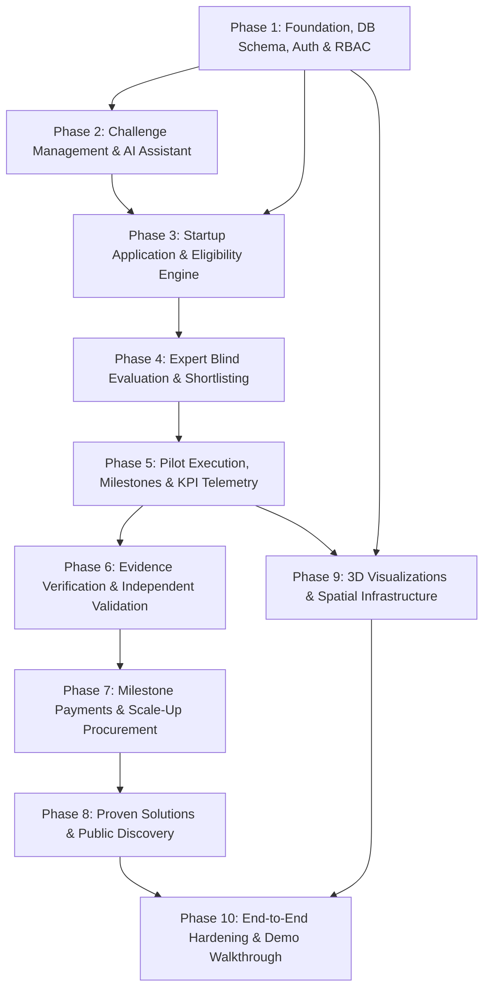

# GovInnovate Phased Implementation Plan & Dependency Matrix

## 1. Feature Dependency Analysis

In a mission-critical GovTech platform, lifecycle stages possess strict dependencies. Building downstream features (such as Milestone Payments or Scale-Up Decisions) before their upstream prerequisites (such as Independent Validation, Evidence Verification, and Blind Evaluations) leads to architectural debt and flawed data models.

### Detailed Dependency Table

| Feature / Module | Upstream Dependencies | Reason for Dependency |
| :--- | :--- | :--- |
| **Department & User RBAC** | Postgres Schema & Auth Engine | All operations are scoped by user role and department context. |
| **Challenge Creation Wizard** | Departments, Rubric Templates | Challenges belong to departments and require predefined scoring rubrics. |
| **AI Challenge Assistant** | Challenge DTO Schemas | AI generates structured fields directly into the wizard's form models. |
| **Startup Applications** | Published Challenges, Startup Profiles | Applications require active challenge definitions and verified company profiles. |
| **Eligibility Screening** | Submitted Applications | Screening evaluates submitted application compliance documents. |
| **Blind Expert Evaluation** | Eligible Applications, COI Signing | Experts cannot access applications without COI declaration and blind masks. |
| **Shortlisting & Pilot Setup** | Completed Evaluations & Consensus Scores | Pilots can only be instantiated from top-ranked, shortlisted applications. |
| **Milestone & KPI Engine** | Active Pilots | Milestones and KPI telemetry belong to a contracted pilot. |
| **Evidence Records** | Milestones, KPIs, Object Storage | Evidence uploads substantiate specific milestones and KPI measurements. |
| **Independent Validation** | Verified Evidence, KPI Time-Series History | Validators audit actual telemetry records and tamper-checked evidence. |
| **Milestone Payments** | Approved Milestones, Validator Verification | Public funds are disbursed only upon verified milestone delivery. |
| **Scale-Up Decision** | Validation Report, Procurement Review | Decisions (Scale/Extend/Close) depend on validated pilot efficacy. |
| **Proven Solutions Library** | Scaled / Validated Pilots | Solutions are promoted exclusively from successfully concluded pilots. |
| **3D Architectural City & Map**| Pilot Geospatial Coordinates, Data Pipeline | 3D visual nodes display real pilot locations and live data flow. |

---

## 2. Phased Implementation Sequence

### Phase 1: Core Foundation, Schema, Auth & RBAC
- **Objectives**: Initialize Next.js project with Tailwind CSS, TypeScript, and Shadcn/Radix UI. Establish PostgreSQL schema (Prisma/Kysely/SQL) with complete migrations, enum types, and foreign key relations.
- **Deliverables**:
  - Full database migrations applied.
  - JWT auth and session handling with Argon2 password hashing.
  - Role switcher and mock login credentials for all 6 roles.
  - Base enterprise layout with header, collapsible sidebar, theme tokens, and breadcrumbs.
  - Append-only audit logger module with SHA-256 hash chaining.
- **Verification Criteria**:
  - All database tables created with foreign keys and check constraints.
  - Users of each role can authenticate and receive appropriate permissions.

### Phase 2: Challenge Management & AI Assistant
- **Objectives**: Build the 7-step Challenge Creation Wizard for Government Officers and Procurement Officers.
- **Deliverables**:
  - 7-Step Stepper: Problem, Outcomes, Specs, Pilot Design, Eligibility, Rubrics, Review.
  - AI Assistant Panel providing real-time problem refinement and KPI suggestions with required disclaimer.
  - Challenge state machine: `DRAFT -> UNDER_REVIEW -> PUBLISHED -> CLOSED`.
  - Procurement Officer review and sign-off drawer.
- **Verification Criteria**:
  - Published challenges appear immediately in public catalog.
  - AI suggestions properly format into form inputs with disclaimer.

### Phase 3: Startup Application & Eligibility Screening
- **Objectives**: Enable Startups to discover challenges and submit comprehensive proposals. Build the Government Eligibility Screening desk.
- **Deliverables**:
  - Startup Profile manager with DPIIT verification and completeness score calculation.
  - Multi-section Application Wizard with draft auto-saving.
  - Government Officer Eligibility Screening Desk with split-screen review and checklist.
- **Verification Criteria**:
  - Submissions generate unique application codes.
  - Eligibility decisions (Eligible, Ineligible, Clarification Required) record timestamps and reviewer ID.

### Phase 4: Blind Expert Evaluation & Shortlisting
- **Objectives**: Implement the impartial, blind evaluation workflow with mandatory Conflict of Interest declaration.
- **Deliverables**:
  - Expert assignment interface for Government Officers.
  - COI Declaration modal that blocks proposal access until signed.
  - Anonymized proposal reader (strips startup name, team identifiers, past clients).
  - Configurable rubric scoring slider with mandatory criterion justifications.
  - Government Officer Evaluation Consensus Matrix and Shortlisting desk.
- **Verification Criteria**:
  - Evaluators cannot see peer scores prior to their own submission.
  - Shortlisting transitions top proposals to Pilot Contracting.

### Phase 5: Pilot Execution, Milestones & KPI Telemetry
- **Objectives**: Build the core operational Pilot Management workstation.
- **Deliverables**:
  - Pilot instantiation engine converting awarded proposals into active pilots.
  - Pilot header with live status, budget, progress bar, and risk badge.
  - Milestone manager supporting deliverables submission, deadlines, and approvals.
  - KPI Engine tracking baseline, target, current value, and historical time-series measurements.
  - Interactive Recharts visualization rendering actual database measurement points.
- **Verification Criteria**:
  - Adding a KPI measurement dynamically updates the pilot's progress charts.
  - Milestones progress through `NOT_STARTED -> IN_PROGRESS -> SUBMITTED -> APPROVED`.

### Phase 6: Evidence Verification & Independent Validation Studio
- **Objectives**: Tamper-evident evidence storage and third-party validation workbench.
- **Deliverables**:
  - Direct file upload workflow generating SHA-256 checksums.
  - Evidence linkers associating files with specific milestones and KPIs.
  - Independent Validator Studio allowing validators to audit methodology, review sensor records, and inspect evidence.
  - Validation Report submission generating formal outcomes: `VALIDATED`, `PARTIALLY_VALIDATED`, `NOT_VALIDATED`.
- **Verification Criteria**:
  - Tamper hash matches file contents.
  - Completed validation report unlocks final milestone and scale-up pathways.

### Phase 7: Milestone Payments & Scale-Up Procurement
- **Objectives**: Public fund disbursement controls and structured scale-up governance.
- **Deliverables**:
  - Payment queue for Procurement Officers linked directly to approved milestones.
  - Mock payment disbursement engine tracking transaction IDs and budget burn rate.
  - Scale-Up Decision Workbench: human-in-the-loop decision modal (`SCALE`, `EXTEND_PILOT`, `MODIFY_AND_RETEST`, `CLOSE`).
  - Formal procurement requisition export.
- **Verification Criteria**:
  - Payments cannot be approved without milestone approval.
  - Scale decisions create immutable audit logs and archive the pilot.

### Phase 8: Proven Solutions Library & Public Discovery
- **Objectives**: Curated catalog of tested, validated GovTech innovations for cross-department replication.
- **Deliverables**:
  - Auto-promotion of `SCALED` / `VALIDATED` pilots to the Proven Solutions Library.
  - Public searchable directory with department, technology, and cost filters.
  - Case study deep dive showcasing verified before/after KPI metrics, costs, and replication specs.
- **Verification Criteria**:
  - Unvalidated pilots cannot be published to the Proven Solutions library.

### Phase 9: 3D Visualizations & Spatial Infrastructure
- **Objectives**: Develop the strategic Three.js / React Three Fiber scenes with strict performance budgeting.
- **Deliverables**:
  - Landing Hero: Architectural 3D City scene with low-poly infrastructure, pulsing pilot nodes, and animated data flows.
  - Government Dashboard: Innovation Ecosystem 3D/2D hybrid node-link pipeline.
  - Pilot Workstation: 3D Geographic Infrastructure map showing pilot sensor coordinates and risk pins.
  - Automatic WebGL fallback to clean SVG schematics on low-power devices.
- **Verification Criteria**:
  - 3D scenes maintain 60 FPS and cleanly pause when scrolled out of view.
  - All critical data accessible without WebGL enabled.

### Phase 10: Realistic Demo Data (Urban Air Quality) & End-to-End Hardening
- **Objectives**: Load complete, realistic demo scenario per Section 46 and perform end-to-end user verification.
- **Deliverables**:
  - Main challenge: Urban Air Quality Monitoring (Lucknow Municipal Corporation).
  - Startup: AirSense Technologies (90-day pilot).
  - Real database measurements: Coverage (35% -> 86%), Accuracy (82% -> 95%), Uptime (76% -> 94%).
  - Full audit trail demonstration.
- **Verification Criteria**:
  - 2-minute judge walkthrough executes smoothly without errors.
  - Complete lifecycle traceable from initial problem statement to scale-up procurement.
